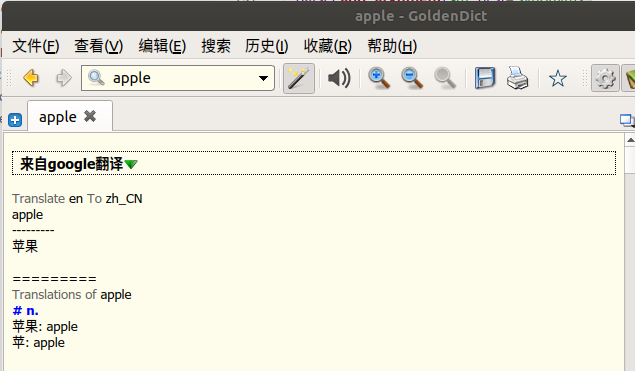

# google-translate-for-goldendict
Add Google translate for GoldenDict

原github: https://github.com/xinebf/google-translate-for-goldendict 本项目在此基础上稍作更改，支持SOCKS5代理

可以在[GoldenDict][1]中添加的 [Google translate][2]命令




**使用方法:**

需要 python 3.7+:

`git clone https://github.com/YexiongLin/google-translate-for-goldendict.git `

`pip3 install ./google-translate-for-goldendict`

GoldenDict - 编辑 - 词典 - 字典来源 - 程序

类型: `Html`

名称: `Google Translate`

命令行: `python -m googletranslate zh-CN %GDWORD%`

类型可以设为 `Html` 或 `纯文本`.

其中: `Html` 对应 `-r "html"`. `纯文本` 对应 `-r "plain"`

```
positional arguments:
  target          target language (eg: zh-CN)
  query           query string

optional arguments:
  -h, --help      show this help message and exit
  -p PORT        SOCKS5 port (eg: 10808)
  -a ALTERNATIVE  alternative language (default: en)
  -r TYPE         result type (default: html)
  -k TKK          tkk
  -m              show synonyms
  -d              show definitions
  -e              show examples
```

[1]: https://github.com/goldendict/goldendict
[2]: https://translate.google.com/
